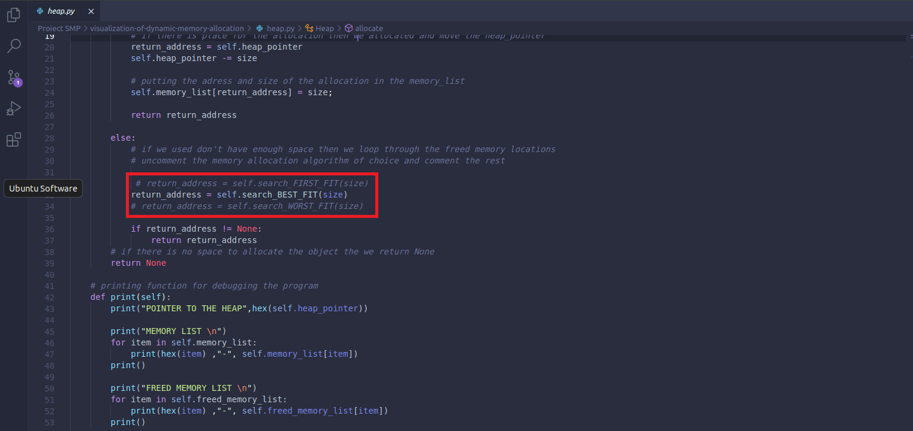
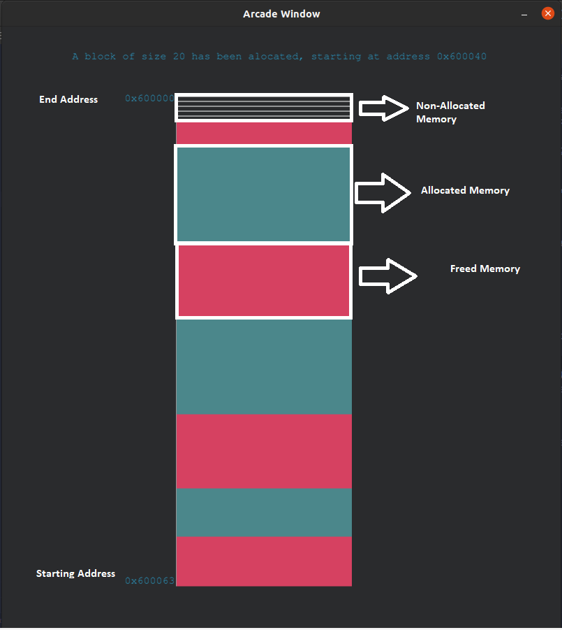

# **Visualization of Dynamic Memory Allocation**

## **Functionalities** 
 

- Simulating the heap memory allocation using some known algorithms in a program. 
- Seeing the allocation and deallocation of blocks in real-time.
- Seeing the addreses where the memory has been allocated/freed and the size.

All to better understand how the memory is being used in a real C program 

 

## **Design and implementation**

 

The project was made using the unicorn-engine emulation in the background. Using the 
code from 'code.asm' and assembying it using an online assembler, the unicorn 
emulator goes step by step with every instruction. When a malloc or free instruction is detected (this was made by keeping all malloc and free instructions addresses in 2 separate variable), this instruction is intercepted by the program and used to determine what it needs to do.

The heap object is made by given it an starting address and a size. The heap contains, beside the starting address in memory and size, a pointer to point where in the heap are we and 2 dictionaries to keep track of allocated memory and freed memory, keeping the the starting address of each block and the size. The allocation method first allocates the full heap then it starts to look at the freed memory location based on the algorithm we choose to use. If it doesn't find a place to allocate then we return 0 and an error message back to the user.

The visualization was made using the arcade library and game engine so that when a malloc or free call was intercepted by the program, we would update the window with the necessary information so that the free and malloc call are shown in real time.

 

## **Difficulties during the project creation**

 

The hardest part of the project was updating the information of the heap in real-time and not just after the instructions are complete. First I tried to use some data science libraries like missingno but to no success. Then I thought I should treat this project as a game and used a game engine and put the logic from the unicorn-engine to the update function and use some rendering functions to render the screen. 

Another difficulty that I encounter was with the heap memory, firsti tried to use functions to allocate or deallocate but i ran into some issues not remembering the previous calls so I used a class for the heap object.

I found some difficulties understanding at what addresses relatively to the RBP register to put the addresses of the memory allocations in the stack.

 
 

## **Install and run the application**
 

### **Cloning the git repository**

Clone with SSH:

    git clone git@gitlab.com:smp2021/334ab/visualization-of-dynamic-memory-allocation.git

Clone with HTTPS:

    git clone https://gitlab.com/smp2021/334ab/visualization-of-dynamic-memory-allocation.git

 

Move into Visualication of Dynamic Memory Allocation

    cd visualization-of-dynamic-memory-allocation

 
 

### **Installing the necessary libraries and running the application**

- Make sure you have [Python 3](https://www.python.org/) on your computer

 

**The following commands should be ran only the first time you run the application!!**

 

First make sure you have install make, if you are on a Debian base system you can use the comand

    sudo apt install make

For installing the libraries for python 3 run the command:

    make install

 
 

### **Running the application**

 

**Here are 3 videos showing the 3 Memory Allocation Algortihms implemented** 

 [First Fit Memory Allocation Algorithm visualization](https://youtu.be/Zog4ldxE4z4)

 [Best Fit Memory Allocation Algorithm visualization](https://youtu.be/nhmQ3qXxwgM)

 [Worst Fit Memory Allocation Algorithm visualization](https://youtu.be/cvvoLS7vaFc)

 
 

**First we can change the heap memory allocation algorithm used by going into the heap.py file, lines 32-34
where we can comment and uncomment depending on what algoritm we want to use**

 
 

**Running the application with python 3**

    make run

 

 
 

### **Clean up**

Run the command:

    make clean

 
 

## **Similar Projects**

1. [Visualizing Dynamic Memory Allocations](https://core.ac.uk/download/pdf/189667001.pdf)  by Sergio Moreta and Alexandru Telea

    - a visualization tool for dynamic memory allocation information obtained from instrumenting the runtime allocator used by C programs. The project aim is to  analyze the behavior of a C runtime allocator running on an embedded platform. The allocator should be able to serve tens of processes with thousands of malloc and free calls per second
        
2. [Visualization of Dynamic Memory in C++ Applications](https://ltu.diva-portal.org/smash/get/diva2:1337031/FULLTEXT01.pdf) by Filip Salén

    - this project aim to create an applicatio  for visualize the dynamic memory allocation for Gold Town Games and their game series World Hockey Manager. For the GUI were used the C++ libraries: Qt and wxWidgets

3. [A Tool for Visualizing the Execution of Programs and Stack Traces Especially Suited for Novice Programmers](https://www.scitepress.org/papers/2017/63369/63369.pdf)

    - this article shows a new way for visualization of program execution by using the CDI(C/C++ Debugging Interface) AND JDI(Java Debugging Interface), the information from those was transformed in JSON format and then used for visualization

 
 

## **References**

- [Unicorn-engine X86](https://github.com/unicorn-engine/unicorn) emulator to emulate the assembly code 
    

- [Shell's storm online assembler](http://shell-storm.org/online/Online-Assembler-and-Disassembler/) to assemble the code in code.asm

- Visualizing the allocation was made using the [arcade](https://arcade.academy/index.html) library

- Learning about memory allocation [algorithms](https://www.tutorialspoint.com/operating_system/os_memory_allocation_qa2.htm) used
    